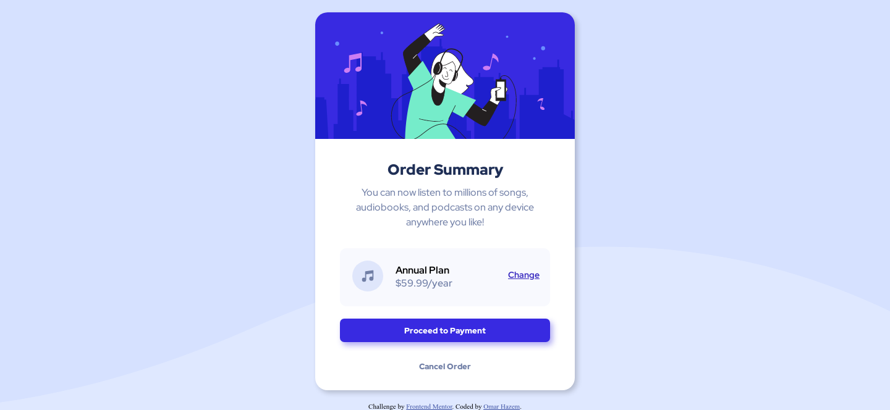

# Frontend Mentor - Order summary card solution

This is a solution to the [Order summary card challenge on Frontend Mentor](https://www.frontendmentor.io/challenges/order-summary-component-QlPmajDUj). Frontend Mentor challenges help you improve your coding skills by building realistic projects. 

## Table of contents

- [Overview](#overview)
  - [The challenge](#the-challenge)
  - [Screenshot](#screenshot)
  - [Links](#links)
- [My process](#my-process)
  - [Built with](#built-with)
  - [What I learned](#what-i-learned)
  - [Continued development](#continued-development)
  - [Useful resources](#useful-resources)
- [Author](#author)
- [Acknowledgments](#acknowledgments)


## Overview

This project focused on building a simple but functional webpage using HTML and CSS. The goal was to practice and apply key web development skills including styling elements, positioning content, and improving user interaction. I learned how to set background images, style buttons, control paragraph layout, and apply visual effects like shadows and rounded corners. The project also introduced useful techniques for text formatting, link behavior, and responsive design principles. It served as a strong foundation for understanding how CSS and HTML work together to create visually engaging web content.

### The challenge

Users should be able to:

- See hover states for interactive elements

### Screenshot




### Links

- Live Site URL: [live site URL](https://omarhazem02.github.io/Order-summary-card/)

## My process

### Built with

- Semantic HTML5 markup
- CSS custom properties


### What I learned

🎨 CSS Styling Basics
How to set a background image on the <body> using background-image.

How to use background-size to control image scaling (cover, contain, etc.).

How to use background-position to control the image placement (e.g., center, top left).

How to add shadows using box-shadow for elements and text-shadow for text.

How to control paragraph line spacing with line-height.

🧱 Layout and Text Control
How to break a line after a specific word using:

<br> for manual line breaks

span + display: block

🔘 Application Button Styling

CSS properties to style buttons:

background-color, color, padding, border, border-radius, cursor, box-shadow, transition

How to style hover and active button states with :hover and :active.

💡 Extra Concepts Learned
CSS shorthand properties (like border-radius: 20px 0 20px 0) to make some corner rounded and some not

Pseudo-elements (like ::after)


Some of the Code Snippets I Learned in This Project

```html

<p>Hello<br>World</p>

```

```css

body {
  background-image: url('images/bg.jpg');
  background-size: cover;
  background-position: center;
  background-repeat: no-repeat;
}

/* Element shadow */
div {
  box-shadow: 4px 4px 12px rgba(0,0,0,0.3);
}

/* Text shadow */
h1 {
  text-shadow: 2px 2px 4px rgba(0,0,0,0.4);
}

```

### Continued development

1. Responsive Design
Learn how to make the layout and buttons adjust nicely on phones and tablets using:

media queries

relative units like %, em, vh, vw

2. Advanced Button Effects
Add animations on hover with @keyframes or transform.

Create different button styles (like ghost buttons, icon buttons).

3. Navigation Menus
Build a navigation bar using <nav>, <ul>, and styled <a> links.

Make it stick to the top of the page or become collapsible.

4. Custom Fonts and Icons
Learn to add Google Fonts.

Use SVG icons or icon libraries like FontAwesome.

5. Transitions and Animations
Add smooth animations for shadows, scaling, or fading.

Use transition, transform, or libraries like Animate.css.

6. Form Styling and Functionality
Create and style a basic form (e.g., contact or feedback).

Learn form validation using HTML or JavaScript.

7. JavaScript Interactivity
Start using basic JavaScript to:

Show/hide elements

Toggle dark mode

Add alerts or form handling

8. Organizing Code Better
Learn how to split CSS into sections or use SCSS (Sass).

Explore CSS variables for colors and spacing.


### Useful resources

- MDN Web Docs helped me expand my knowledge on certain topics while creating this page..
- Chat gpt and Claude supported me as  mentors by helping evaluate and review my code throughout the project.

## Author

- Website - [Omar Hazem](https://www.linkedin.com/in/omar-hazem-aa287a273/)
- Twitter - [@OmarHaz67778375]([https://www.twitter.com/yourusername](https://x.com/OmarHaz67778375))


## Acknowledgments

I would like to acknowledge AlMadersa, where I am currently studying in the Front-End Development Diploma program. Special thanks to my course tutor, Mohamed Abu Sarea (محمد أبو سريع), for his valuable guidance and support.

